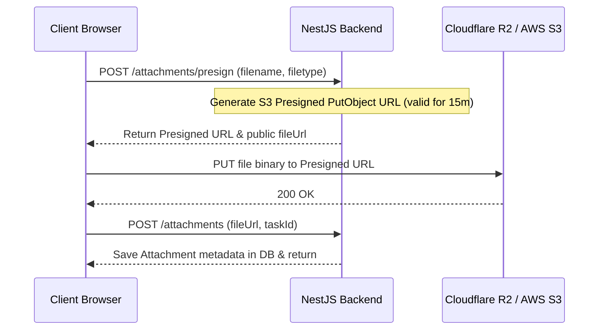

# Cloud Storage & Observability Architecture Readiness Guide

This document outlines the architectural blueprints for transitioning the Enterprise Project Management System from local file storage to Cloud Object Storage and integrating production monitoring, metrics tracking, and error observability.

---

## 1. Cloud Object Storage Roadmap

Currently, the application stores uploaded task attachments in local persistent directories. For production reliability, high availability, and scalability, these must migrate to an S3-compatible object storage provider (e.g., **Cloudflare R2**, **AWS S3**, or **MinIO**).

### Proposed Upload Flow (Presigned URLs)

To minimize backend CPU and network consumption, uploads should bypass the NestJS server and go directly from the client browser to the bucket using secure **Presigned URLs**.



### Configuration Requirements
Add these environment variables to NestJS and configure the AWS SDK:
```bash
STORAGE_PROVIDER=s3 # s3, r2, local
STORAGE_BUCKET_NAME=pms-production-attachments
STORAGE_ENDPOINT=https://<account_id>.r2.cloudflarestorage.com # Or s3.amazonaws.com
STORAGE_ACCESS_KEY_ID=sec-key-id
STORAGE_SECRET_ACCESS_KEY=sec-access-secret
```

---

## 2. Observability & Monitoring Setup

For production monitoring, we design a three-pillar observability stack:
1. **Metrics Collection** (Prometheus & Grafana)
2. **Exception Tracking** (Sentry)
3. **Structured Logs Analysis** (Loki / ELK)

### Prometheus Scraping Flow

NestJS will expose a Prometheus scraping endpoint using `@willsoto/nestjs-prometheus` at `/metrics` (marked `@Public()` and restricted by CIDR whitelist or basic auth).

```text
+-----------------------+           metrics scrape           +------------------+
|   NestJS Application  |  <------------------------------   |    Prometheus    |
|   (exposing /metrics) |                                    +--------+---------+
+-----------------------+                                             |
                                                                      | pull metrics
                                                                      v
                                                             +------------------+
                                                             |     Grafana      |
                                                             |   (Dashboards)   |
                                                             +------------------+
```

### Key Metrics to Monitor
* `http_request_duration_seconds`: Response latency histograms.
* `prisma_client_queries_total`: Database query counts and durations.
* `process_cpu_seconds_total` & `process_resident_memory_bytes`: System resource consumption.
* `nestjs_throttler_rate_limits_exceeded_total`: API rate-limiting blocks.

---

## 3. Sentry Error Tracking Integration

Sentry will intercept and report all unhandled exceptions occurring in the backend or frontend servers.

### NestJS Integration (Sentry Interceptor)
Implement a global Sentry interceptor in NestJS to capture exceptions:

```typescript
import { CallHandler, ExecutionContext, Injectable, NestInterceptor } from '@nestjs/common';
import * as Sentry from '@sentry/node';
import { Observable } from 'rxjs';
import { tap } from 'rxjs/operators';

@Injectable()
export class SentryInterceptor implements NestInterceptor {
  intercept(context: ExecutionContext, next: CallHandler): Observable<any> {
    return next.handle().pipe(
      tap({
        error: (exception) => {
          Sentry.captureException(exception, {
            extra: {
              request: context.switchToHttp().getRequest().url,
            },
          });
        },
      }),
    );
  }
}
```

### Frontend Integration (Next.js Sentry SDK)
Install `@sentry/nextjs` and configure `sentry.client.config.js` and `sentry.server.config.js` with your production DSN to capture errors and track performance bottlenecks on the client.
