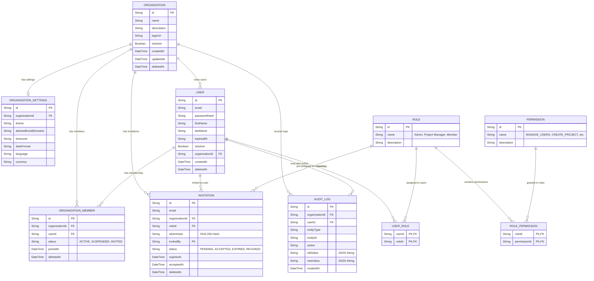
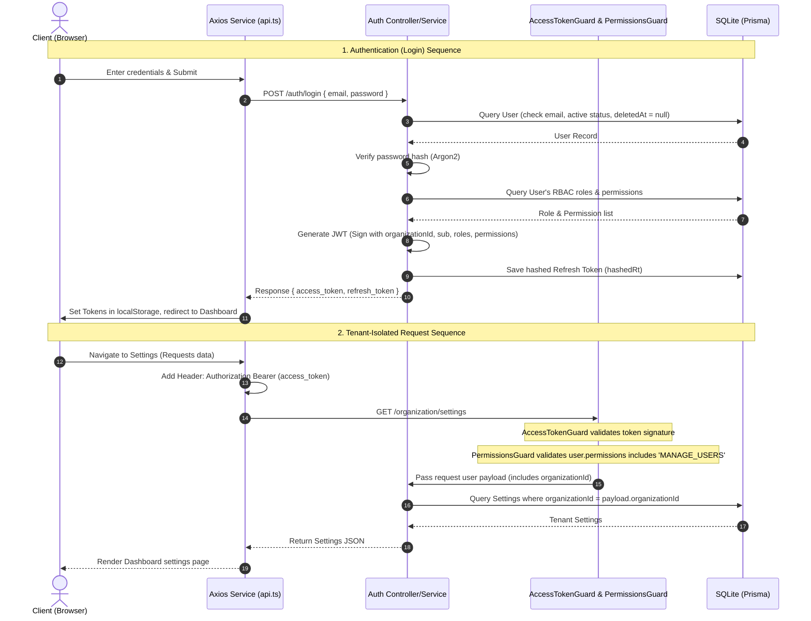

# Project Architecture & Database Schema Guide

This guide provides an overview of the Enterprise Project Management System's architecture, file structure, database schema, and key request flows. Use it to navigate the codebase and understand how the frontend and backend interact.

---

## 📂 Monorepo File Map

The codebase is organized as a monorepo containing a NestJS backend and a Next.js frontend:

```yaml
root/
├── backend/                             # NestJS Backend Application
│   ├── prisma/
│   │   ├── schema.prisma                # Database Models & Schema Definition
│   │   └── seed.ts                      # Seeding Script (Admin, Roles, Permissions)
│   ├── src/
│   │   ├── app.module.ts                # Main App Module (registers guards and sub-modules)
│   │   ├── auth/                        # JWT Auth, Strategy, Decorators & Guards
│   │   │   ├── decorators/              # Custom Decorators (@TenantId, @Permissions, etc.)
│   │   │   ├── guards/                  # AccessTokenGuard, RefreshTokenGuard, PermissionsGuard
│   │   │   ├── strategies/              # Passport JWT Access/Refresh Strategies
│   │   │   ├── auth.controller.ts       # Registration, Login, Token Refresh, Invite Acceptance
│   │   │   └── auth.service.ts          # Authentication logic & JWT Generation
│   │   ├── organization/                # Member Management, Settings, and Audit Logs
│   │   ├── invitation/                  # Member invitation generation and token hashing
│   │   ├── audit/                       # Global Immutable Audit Logging Service
│   │   └── prisma/                      # Prisma Client Service configuration
│   └── package.json
│
└── frontend/                            # Next.js Frontend Application
    ├── app/                             # App Router Pages
    │   ├── (auth)/                      # Public Authentication routes
    │   │   ├── login/page.tsx           # Login Screen
    │   │   ├── register/page.tsx        # Registration (New Org Creation) Screen
    │   │   └── accept-invite/page.tsx   # Invitation Onboarding Screen
    │   ├── (dashboard)/                 # Protected Dashboard routes
    │   │   ├── dashboard/page.tsx       # Core User Dashboard
    │   │   └── settings/page.tsx        # Admin Settings & Member Management Panel
    │   └── layout.tsx                   # Main Root Layout & Providers Wrapper
    ├── hooks/
    │   └── useAuth.ts                   # Custom Hook (user session, login, register, acceptInvite)
    ├── services/
    │   └── api.ts                       # Axios Client (with Auth interceptor and Silent Refresh)
    └── package.json
```

---

## 🗄️ Database Entity Relationship Diagram (ERD)

This diagram visualizes the relational schema defined in [schema.prisma](file:///c:/Salesforce/Labs/NSK/Project%20Management%20System/backend/prisma/schema.prisma). It highlights the separation between multi-tenant organization constraints and the Role-Based Access Control (RBAC) tables:



---

## 🔑 Authentication & Request Flow

This diagram illustrates how a user logs in, receives a token containing organization context, and makes a tenant-isolated request to the API:



---

## ✉️ Onboarding Invitation Flow

How an administrator invites a new team member, and how that member accepts the invitation:

```mermaid
sequenceDiagram
    autonumber
    actor Admin as Admin (Browser)
    participant API as Backend (NestJS)
    participant DB as SQLite (Prisma)
    actor Invitee as Invitee (Browser)

    %% Invitation Creation
    Note over Admin, DB: Phase A: Admin Invites New Member
    Admin->>API: POST /invitations { email, roleId }
    Note over API: Verify Admin holds 'INVITE_MEMBERS' permission
    Note over API: Check if email is already registered
    API->>API: Generate random token: crypto.randomBytes(32)
    API->>API: Compute SHA-256 Hash of raw token
    API->>DB: Save Invitation (store email, roleId, organizationId, tokenHash)
    API->>API: Print raw token in terminal console
    API-->>Admin: Return { rawToken, email, expiresAt }
    Note over Admin: Admin shares register link with rawToken

    %% Invitation Acceptance
    Note over Invitee, DB: Phase B: Invitee Accepts Invitation
    Invitee->>Invitee: Navigate to /accept-invite?token=rawToken
    Invitee->>API: POST /auth/accept-invite { token, password, firstName, lastName }
    API->>API: Compute SHA-256 Hash of incoming token
    API->>DB: Query Invitation where tokenHash = input & status = PENDING & active
    DB-->>API: Invitation details (email, organizationId, roleId)
    
    rect rgb(15, 23, 42)
        Note over API, DB: Transaction Block
        API->>DB: Create User (linked to organizationId, hashed password)
        API->>DB: Create OrganizationMember (status: ACTIVE)
        API->>DB: Create UserRole (assign roleId)
        API->>DB: Update Invitation (status: ACCEPTED, acceptedAt: now)
    end

    API->>API: Sign Access/Refresh Tokens (with organizationId)
    API-->>Invitee: Return { access_token, refresh_token }
    Invitee->>Invitee: Logged in and redirected to Dashboard
```


